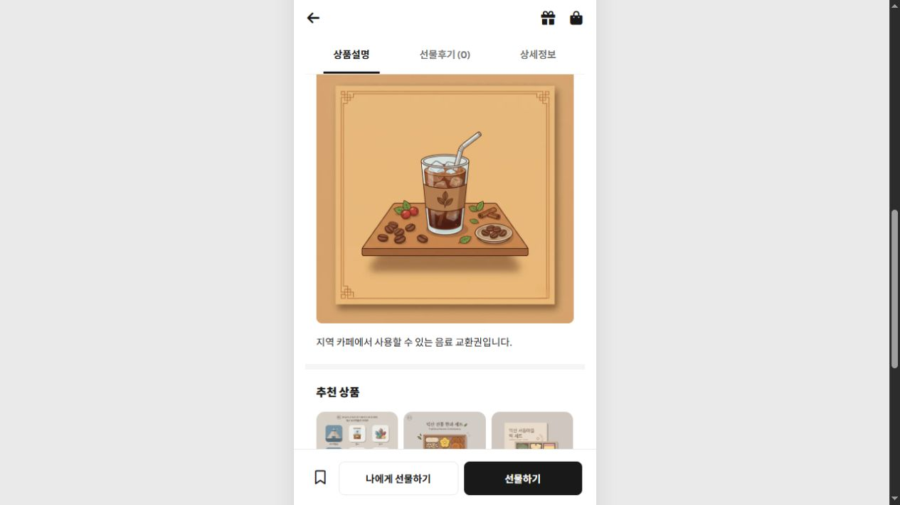
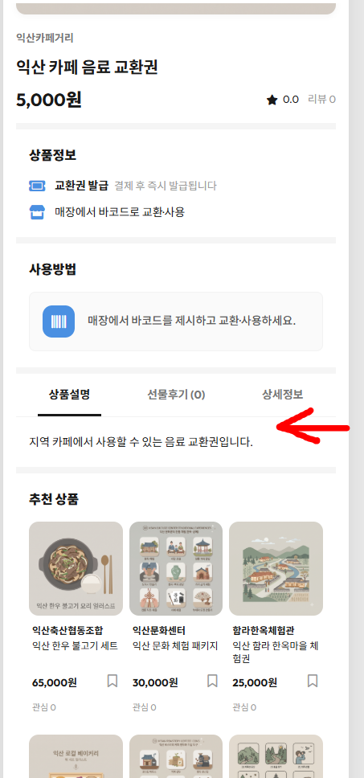

# 상품 데이터 보완 기록 — #138 보완 1번 상품 설명 이미지·사용방법

상태: **2026-09-29 운영 적용 완료 / 변경 전후 기록**

적용 전 조회 시각: 2026-09-29 10:47:42 UTC (한국시간 19:47:42)

이 문서와 JSON은 위 조회 결과에 기반한 변경안과 2026-09-29 운영 반영 결과를 보관한다. **운영 데이터 반영은 이미 완료됐으며, PR 머지는 이 기록을 저장소에 반영하는 작업이다.** 과거 스냅샷을 재적용하거나 최신 운영 값으로 오해하지 않는다.

Ethan이 서비스 관리자 권한(`admin`)을 받은 뒤 기존 상품 수정 화면에서 반영했다. 서버 접속·DB 직접 수정·seed 재실행은 하지 않았다.

## 적용 결과

- 설명 이미지 18개 연결 완료 — 상품 ID 76~93
- 사용방법 10개 보완 완료 — 30일·배송 표현 정리 및 교환 안내 추가
- 당시 공개 API에서 변경안과의 일치 및 대상 외 공개 필드 보존 확인
- 당시 실제 상품 상세페이지에서 설명 이미지 18개 정상 표시 확인
- 유효기간(`validPeriod`)은 이번 적용 범위에서 제외했다. 이후 Aon이 1년 입력 완료를 별도로 공유했으며, 이 문서의 적용 전 스냅샷과 구분한다.

[2026-09-29 운영 반영 완료 코멘트](https://github.com/adapterz/wku-iksan-store-BE/pull/143#issuecomment-5889788581)와 [Aon의 운영 API 대조 확인](https://github.com/adapterz/wku-iksan-store-BE/pull/143#issuecomment-5967410096)을 근거로 상태를 정정했다. 이번 문서 수정에서 운영 데이터를 다시 변경한 것은 아니다.

## 적용 전 상태 — 이미지 파일은 있지만 상품에 연결되지 않음

**상품 상단 썸네일이 아니라, 하단 ‘상품설명’ 탭의 설명 이미지가 대상이다.** 적용 전에는 이미지 파일과 FE 표시 코드가 존재해도 운영 상품 API의 `descriptionImageUrl`이 비어 있어 해당 영역이 숨겨졌다. 아래 캡처와 표는 설명 텍스트만 표시됐던 당시 기록이다.

사용자가 제공한 2026-09-29 적용 전 운영 화면. 빨간 화살표는 상품설명 영역을 가리킨다. 캡처 한 장만으로 전체 상품 상태를 판단한 것은 아니며, 당시 별도로 공개 상품 18개의 상세 API에서 연결 값이 모두 null임을 확인했다.

| 확인 대상 | 상품 81 예시 | 적용 전 확인 결과 |
| --- | --- | --- |
| 운영 상세 화면 | [익산 카페 음료 교환권](https://iksan.store/product?id=81) | 설명 텍스트만 표시 |
| FE에 배포된 이미지 파일 | [description_cafe_drink.webp](https://iksan.store/images/description_cafe_drink.webp) | 정상 응답, 200 / image/webp |
| 상품 데이터 | [공개 상세 API](https://iksan.store/api/products/81)의 `descriptionImageUrl` | `null` |
| FE 표시 조건 | 이미지 URL이 있으면 표시, 없으면 영역 숨김 | 적용 전 데이터에서는 숨김 |

이번 보완은 **새 이미지나 FE 렌더링 기능을 만드는 것이 아니라, 준비된 이미지 경로를 해당 상품 데이터에 연결한 작업**이다. 이미지가 없거나 로드에 실패할 때 깨진 화면을 막는 FE 예외 처리 작업과는 별개다.

## 이전에는 보였던 것 아닌가?

- [9월 3일 FE 구현 기록](https://github.com/adapterz/wku-iksan-store-FE/commit/e3f641a0230606ae32a6af224b6d04978d0065d4)에 **로컬 DB**에서 값이 있는 상품의 이미지 표시를 확인했다는 기록이 있다.
- [9월 8일 FE 이미지·렌더링 보완](https://github.com/adapterz/wku-iksan-store-FE/commit/a4aef6443ea70dca7b7454b6daf0846c9eba2afe), [9월 9일 이미지 추가](https://github.com/adapterz/wku-iksan-store-FE/commit/3953509f35dd17ac2f789bd1f85c66d1feba4791), [BE seed 연결 경로 추가](https://github.com/adapterz/wku-iksan-store-BE/commit/023ea202dc554859c07d01d538962f480952b6ec)도 확인했다.
- 따라서 과거 로컬/시연 환경에서 이미지가 보였을 가능성은 있다. 다만 이 기록은 **당시 운영 DB에도 값이 들어 있었다는 증거는 아니다.** 운영에서 처음부터 비어 있었는지, 이후 변경됐는지는 당시 DB 백업·변경 기록 또는 화면 기록 없이는 확정할 수 없다.
- 기존 `migrate_product_description_image.sql`은 컬럼 추가만 수행한다. seed 파일에 경로를 추가하거나 코드를 배포해도 기존 운영 상품의 값이 자동으로 채워지는 것은 아니다. 이 차이만으로 현재 누락의 발생 원인을 확정하지는 않는다.

## 당시 적용 범위 — 완료

1. 상품별 설명 이미지 URL 18개를 입력했다. 예: 상품 81 → `/images/description_cafe_drink.webp`.
2. 사용방법 10개를 반영했다. 30일·배송 표현 정정과 나머지 8개의 교환 안내 보충을 구분하며, 모두 필수 오류 수정이라는 의미는 아니다.
3. 유효기간·상품명·가격 등 대상 외 필드를 보존하고, 공개 API와 상품 상세 화면에서 결과를 확인했다.

**운영 반영은 2026-09-29에 완료했다. 이 PR은 적용 기록용이며, 머지 후 데이터를 다시 입력할 필요는 없다.**

## 적용 전 조사·범위 결정 기록

아래 항목은 적용 전 조사 내용과 범위 결정 근거이며, 현재 미완료 목록이 아니다.

- 운영 공개 목록과 상세 API를 GET으로 조회한 상품 18개(ID 76~93)에 설명 이미지 URL이 모두 비어 있음. 비공개·숨김 상품 전체를 검사한 결과는 아님.
- 연결 후보 이미지 18개는 모두 HEAD 200 / image/webp 확인. 이번 점검은 파일 응답과 seed 대응 확인이며, 이미지 내부의 모든 글자·상품 구성·표현에 대한 육안 승인까지 대신하지 않음.
- 사용방법 10개를 보완 후보로 정리. 76의 30일 표기는 1년 정책과 불일치, 78의 배송 표현은 매장 교환형 방향과 불일치. 나머지 8개는 보관/섭취 등 설명만 있고 교환 방법이 없는 상태를 보완하는 제안으로, 모두 결함으로 단정하지 않음.
- 기존 seed의 매장 교환형 문구를 활용하되 기존 보관·섭취 안내는 임의 삭제하지 않고 유지. 기간은 Aon 담당 유효기간 필드에 맡기고 사용방법에는 중복 기재하지 않음.
- 유효기간 값 입력·통일은 Aon 작업이므로 **validPeriod를 요청에 포함하지 않음**. 적용 전 조회 시점에는 null이었으며, 이후 Aon의 별도 작업과 구분한다.
- 상품명·가격·브랜드·썸네일·설명·교환처·주의사항·카테고리·상태는 수정하지 않음. 특히 운영 상품명을 seed의 이름으로 바꾸지 않음.
- BE/FE 코드 변경 및 DB 스키마 마이그레이션은 필요하지 않음. seed 실행·직접 SQL 변경·캐시 직접 삭제는 하지 않음.

## 상품별 연결 결과

동일 브랜드·가격 후보의 유일성을 확인하고 상품 종류·용량·명칭을 대조한 수동 매핑이다. 브랜드·가격만으로 향후 자동 연결하는 규칙이 아니다.

| ID | 운영 상품명 | 설명 이미지 URL | 사용방법 |
|---|---|---|---|
| 76 | 익산역 아메리카노 교환권 | `/images/description_americano.webp` | 보완 완료 |
| 77 | 익산 로컬 베이커리 세트 | `/images/description_bakery_set.webp` | 기존 유지 |
| 78 | 익산 한우 불고기 세트 | `/images/description_hanwoo_bulgogi_set.webp` | 보완 완료 |
| 79 | 익산 황등 비빔밥 이용권 | `/images/description_bibimbap_voucher.webp` | 기존 유지 |
| 80 | 익산 농산물 꾸러미 | `/images/description_produce_bundle.webp` | 보완 완료 |
| 81 | 익산 카페 음료 교환권 | `/images/description_cafe_drink.webp` | 기존 유지 |
| 82 | 익산 전통시장 상품권 | `/images/description_traditional_market.webp` | 기존 유지 |
| 83 | 익산 수제 한과 세트 | `/images/description_hangwa_set.webp` | 보완 완료 |
| 84 | 익산 미륵산 체험권 | `/images/description_mireuksan_experience.webp` | 기존 유지 |
| 85 | 익산 보석박물관 입장권 | `/images/description_gem_museum.webp` | 기존 유지 |
| 86 | 익산 쌀 10kg | `/images/description_rice_10kg.webp` | 보완 완료 |
| 87 | 익산 딸기 세트 | `/images/description_strawberry_set.webp` | 보완 완료 |
| 88 | 익산 커피 원두 세트 | `/images/description_coffee_bean_set.webp` | 보완 완료 |
| 89 | 익산 지역 특산품 선물세트 | `/images/description_specialty_gift_set.webp` | 보완 완료 |
| 90 | 익산 문화 체험 패키지 | `/images/description_culture_experience.webp` | 기존 유지 |
| 91 | 익산 서동마을 떡 세트 | `/images/description_seodong_rice_cake.webp` | 보완 완료 |
| 92 | 익산 함라 한옥마을 체험권 | `/images/description_hamra_hanok_experience.webp` | 기존 유지 |
| 93 | 익산 로컬 와인 선물세트 | `/images/description_wine_set.webp` | 보완 완료 |

## 사용방법 변경 전후 — 2026-09-29 적용 기록

### 76. 익산역 아메리카노 교환권

- 변경 전: 발급일로부터 30일 이내 사용 가능합니다.
- 반영 후: 교환권 제시 후 매장에서 아메리카노로 교환 가능합니다.

### 78. 익산 한우 불고기 세트

- 변경 전: 배송 수령 후 냉장 보관해주세요.
- 반영 후: 교환권 제시 후 매장에서 한우 불고기 세트로 교환 가능합니다. 교환 후 냉장 보관해주세요.

### 80. 익산 농산물 꾸러미

- 변경 전: 수령 후 냉장 보관해주세요.
- 반영 후: 교환권 제시 후 매장에서 농산물 꾸러미로 교환 가능합니다. 수령 후 냉장 보관해주세요.

### 83. 익산 수제 한과 세트

- 변경 전: 개봉 후 빠른 섭취를 권장합니다.
- 반영 후: 교환권 제시 후 매장에서 한과 세트로 교환 가능합니다. 개봉 후 빠른 섭취를 권장합니다.

### 86. 익산 쌀 10kg

- 변경 전: 직사광선을 피해 보관해주세요.
- 반영 후: 교환권 제시 후 매장에서 쌀 10kg으로 교환 가능합니다. 직사광선을 피해 보관해주세요.

### 87. 익산 딸기 세트

- 변경 전: 냉장 보관 후 섭취하세요.
- 반영 후: 교환권 제시 후 매장에서 딸기 세트로 교환 가능합니다. 냉장 보관 후 섭취하세요.

### 88. 익산 커피 원두 세트

- 변경 전: 개봉 후 밀봉 보관하세요.
- 반영 후: 교환권 제시 후 매장에서 원두 세트로 교환 가능합니다. 개봉 후 밀봉 보관하세요.

### 89. 익산 지역 특산품 선물세트

- 변경 전: 선물용 또는 가정용으로 이용 가능합니다.
- 반영 후: 교환권 제시 후 매장에서 특산품 선물세트로 교환 가능합니다. 선물용 또는 가정용으로 이용 가능합니다.

### 91. 익산 서동마을 떡 세트

- 변경 전: 수령 후 냉장 보관하며 빠른 섭취를 권장합니다.
- 반영 후: 교환권 제시 후 매장에서 떡 세트로 교환 가능합니다. 수령 후 냉장 보관하며 빠른 섭취를 권장합니다.

### 93. 익산 로컬 와인 선물세트

- 변경 전: 직사광선을 피해 서늘한 곳에 보관해주세요.
- 반영 후: 교환권 제시 후 매장에서 와인 선물세트로 교환 가능합니다. 직사광선을 피해 서늘한 곳에 보관해주세요.

## 당시 적용 계획·안전 기준 — 참고용

아래는 적용 전 작성했던 절차를 기록으로 보존한 것이다. **재실행 요청이 아니다.** 이후 수정이 필요하면 최신 운영 값을 다시 확인한다.

1. 관리자 권한과 수정 범위를 확인하고 승인된 상품만 처리한다. 초안 작성 시에는 조회만 했고, 이후 관리자 권한을 받은 뒤 별도로 적용을 완료했다.
2. 적용 직전 관리자 조회로 ID·이름·브랜드·가격과 수정 대상 필드의 현재 값을 다시 확인한다. 이미 다른 사람이 수정한 값이면 덮어쓰지 말고 차이를 검토한다.
3. 기존 `PATCH /api/admin/products/:id`에 JSON의 `proposed` 객체에 있는 필드만 전달한다. API 검증기는 생략한 필드를 보존하고 기존 캐시 무효화 경로를 사용한다.
4. 관리자 화면으로 작업한다면 최신 목록을 다시 불러오고 폼 전체가 저장되는지 확인한다. Aon이 유효기간을 수정하기 전 열어둔 낡은 폼은 저장하지 않는다.
5. 1개 대표 상품을 먼저 저장·재조회하고 상품 상세에서 이미지와 문구, 보존 필드를 확인한 뒤 나머지를 진행한다.
6. 수정 직전 원본 및 변경 후 값을 기록한다. 실패 시 성공한 범위를 구분하고, 복구 시에도 대상 필드만 최신 값과 대조해 되돌린다. 이 문서의 오래된 전체 스냅샷을 통째로 덮어쓰지 않는다.

기록용 데이터: [상품별 변경 전후 JSON](PRODUCT_CONTENT_REVIEW_20260929.json). 실행 스크립트나 최신 운영 스냅샷이 아니다. `before`는 적용 전 조회값, `proposed`는 당시 제안해 2026-09-29에 반영한 값이며 기존 키는 기록 호환성을 위해 유지한다.

## 근거

- [기존 보완 코멘트](https://github.com/adapterz/wku-iksan-store-BE/issues/138#issuecomment-5777233026)
- [상품 상세 검증 기록](https://github.com/adapterz/wku-iksan-store-BE/issues/126#issuecomment-5777231882)
- [BE 기존 seed 내용](https://github.com/adapterz/wku-iksan-store-BE/blob/4996b64563c6e597f01f49509adea3be187a7df8/db/seed.sql) — 참고용이며 재실행하지 않음
